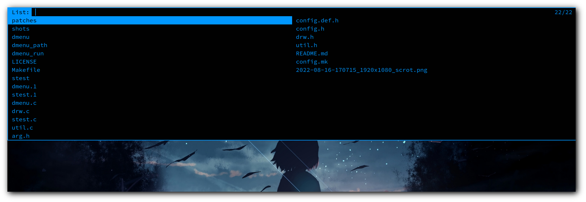

dmenu - dynamic menu
====================

dmenu is an efficient dynamic menu for X.

### Requirements

In order to build dmenu you need the `Xlib` header files.

### Installation

Edit config.mk to match your local setup
(dmenu is installed into the /usr/local namespace by default).

Afterwards enter the following command to build and install dmenu
(if necessary as root):

    make clean install

### Running dmenu

See the man page for details.

### Applied patches

- grid
    - gridnav
- center
- password
- numbers
- border

### Screenshot

