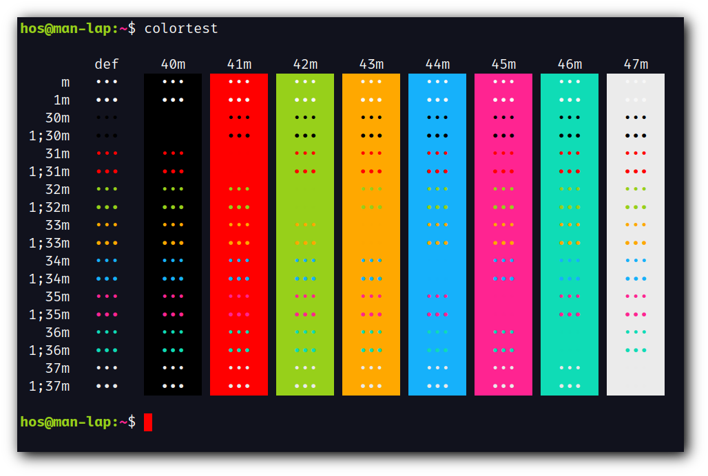
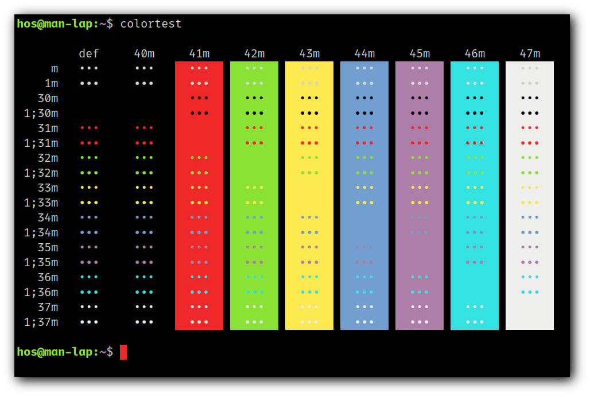
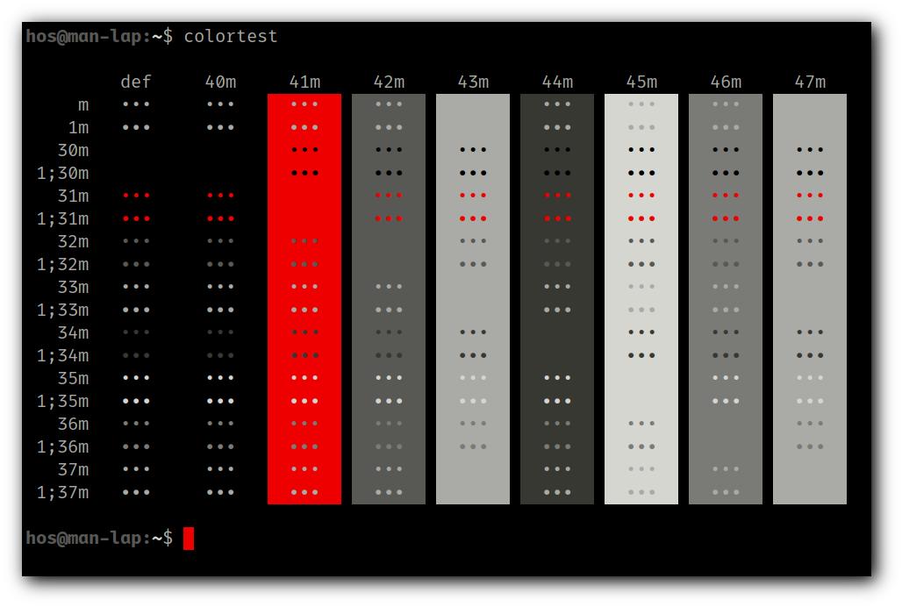
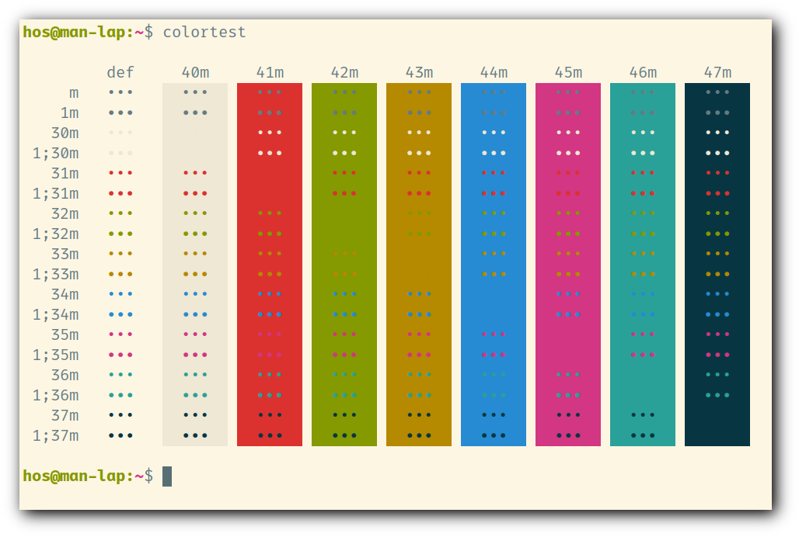

# st - simple terminal

st is a simple terminal emulator for X which sucks less.

## Requirements

In order to build st you need the Xlib header files.

## Installation

Edit config.mk to match your local setup (st is installed into
the /usr/local namespace by default).

Afterwards enter the following command to build and install st (if
necessary as root):

    make clean install

## Running st

If you did not install st with make clean install, you must compile
the st terminfo entry with the following command:

    tic -sx st.info

See the man page for additional details.

## Credits

Based on Aurélien APTEL <aurelien dot aptel at gmail dot com> bt source code.

## Screenshot

- Colorscheme:

2. Dracula
3. Solarized-dark
4. Gruvbox-dark
5. Ubuntu
6. Tango
7. 256_noir
8. Solarized-light

| 0. Termite                  | 1. Hos              |
|:---------------------------:|:-------------------:|
|  |  |

| 2. Dracula                  | 3. Solarized-dark                         |
|:---------------------------:|:-----------------------------------------:|
|  |  |

| 4. Gruvbox-dark                       | 5. Ubuntu                 |
|:-------------------------------------:|:-------------------------:|
|  |  |

| 6. Tango                  | 7. 256_noir                   |
|:-------------------------:|:-----------------------------:|
|    |  |

| 8. Solarized-light                                |
|:-------------------------------------------------:|
|  |
