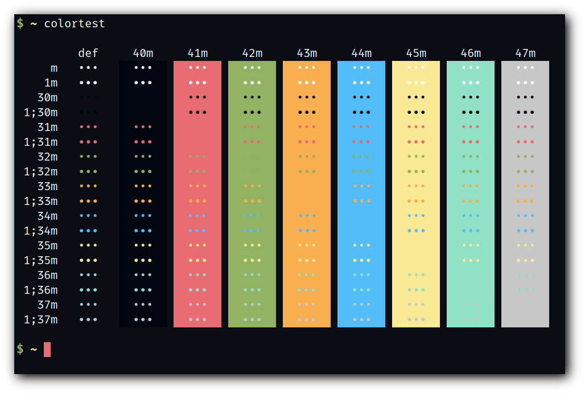
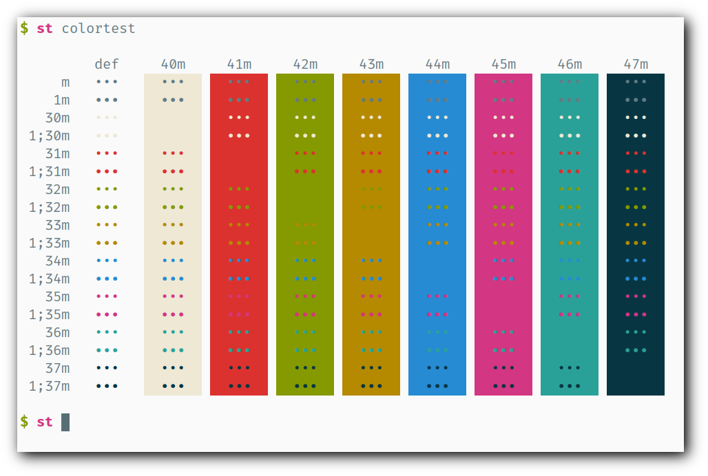

# st - simple terminal

st is a simple terminal emulator for X which sucks less.

## Requirements

In order to build st you need the Xlib header files.

## Installation

Edit config.mk to match your local setup (st is installed into
the /usr/local namespace by default).

Afterwards enter the following command to build and install st (if
necessary as root):

    make clean install

## Running st

If you did not install st with make clean install, you must compile
the st terminfo entry with the following command:

    tic -sx st.info

See the man page for additional details.

## Credits

Based on Aurélien APTEL <aurelien dot aptel at gmail dot com> bt source code.

## Screenshot

- Colorscheme:

| 0. Dracula                                  | 1. Solarized-dark                                 |
|:-------------------------------------------:|:-------------------------------------------------:|
|            |    |

| 3. Gruvbox-dark                             | 4. Nord                                           |
|:-------------------------------------------:|:-------------------------------------------------:|
|  |        |

| 4. Ubuntu                                   | 5. Ayu-dark                                       |
|:-------------------------------------------:|:-------------------------------------------------:|
|              |                |

| 6. Hos                                      | 7. Termite                                        |
|:-------------------------------------------:|:-------------------------------------------------:|
|                    |                  |

| 8. 256_noir                                 | 9. Solarized-light                                |
|:-------------------------------------------:|:-------------------------------------------------:|
|          |  |
